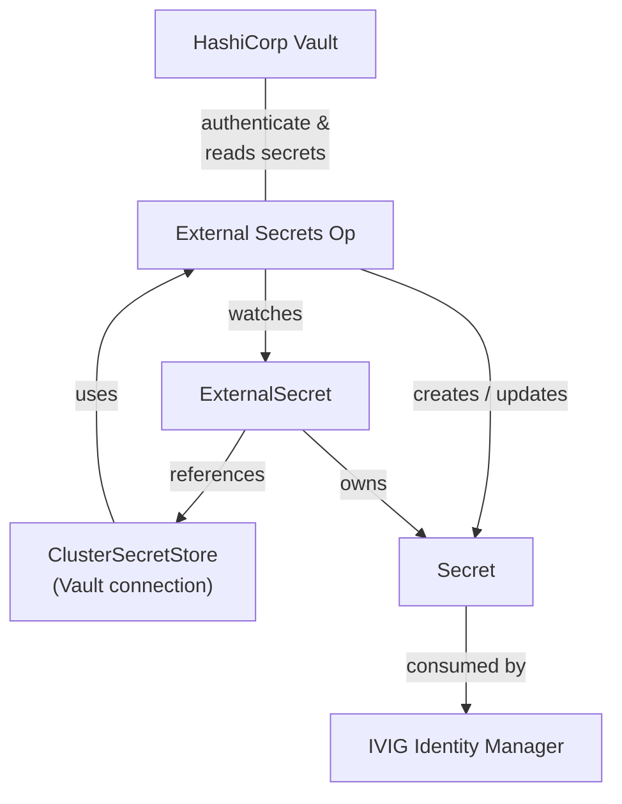

# Vault Integration

[HashiCorp Vault](https://developer.hashicorp.com/vault/docs) is a secure secrets management platform that centrally stores, controls access to, and protects sensitive data such as passwords, API keys, certificates, and encryption keys.

The [External Secrets Operator](https://external-secrets.io/) is a Kubernetes operator that synchronizes secrets from external secret management systems such as [Vault](https://developer.hashicorp.com/vault/docs) into Kubernetes Secret objects.

With Vault Integration enabled, you can securely store all or a subset of the credentials from `secrets.yaml` in Vault, which will be automatically propagated to the k8s cluster and exposed to the containers in a secure manner. Additionally, PKI related files, such as private keys and certificates can also be sourced from Vault and mounted to the containers in a similar way.

```
                              +---------------------+
                              |   HashiCorp Vault   |
                              +---------------------+
                                         ^
                                         | authenticates &
                                         | read secrets
                                         |
+--------------------+        +---------------------+
| ClusterSecretStore | -----> | External Secrets Op | -----------------+
| (Vault connection) |  uses  +---------------------+     creates /    |
+--------------------+                   |                updates      |
           ^                             | watches                     |
           |                             v                             v
           |                    +----------------+            +----------------+
           +------------------- | ExternalSecret | ---------> |     Secret     |
             references         +----------------+    owns    +----------------+
                                                                       |
                                                                       | consumed by
                                                                       v
                                                           +-----------------------+
                                                           | IVIG Identity Manager |
                                                           +-----------------------+
```



When using Vault in tandem with Argo CD, this recommended integration pattern even avoids exposing the sensitive data to Argo CD itself - it will merely reference, but never actually access or read the sensitive data. There is an alternative integration option using the Argo CD Vault Plugin which retrieves the secrets from within Argo CD, but thus is deemed less secure and obsolete.

## Prerequisites

- [Vault](https://developer.hashicorp.com/vault/docs/get-vault#install-options) up and running (tested on Vault Enterprise 1.15.4)
- [External Secrets Operator](https://external-secrets.io/latest/introduction/getting-started/) running (0.10.3 or newer)

There are two optional user convenience scripts for importing from and exporting to Vault, which require the following dependencies in addition to what is already documented under [System Requirements](../README.md#system-requirements):
- `vault-create-json.sh`: bash 3.2, jq 1.5
- `vault-json-to-files.py`: python 3.6

## Vault configuration

The steps in this guide have been tested on Vault Enterprise. Integration with Vault Community Edition (Open Source) requires slight adjustments, specifically, because it does not support Vault namespaces (the root namespace is used implicitly).

Vault namespaces provide isolated environments within a single Vault cluster. Each namespace can have its own:
- Secret engines
- Authentication methods
- Policies
- Identity entities/groups
- Tokens
- Audit devices (depending on configuration)

Vault configuration instructions, unless specifically noted otherwise, are carried out on Vault web UI, after successful login and making sure the desired Vault namespace is selected (bottom left) if your Vault uses multiple namespaces.

### Access Controls

On the Vault web UI, navigate via the main menu to **Policies / ACL Policies**. Create Policy "read-secrets" with the content below which will grant read access to sensitive date stored under `secrets` and `certs`.

```
# Read secret values
path "secrets/data/*" {
  capabilities = ["read"]
}
path "certs/data/*" {
  capabilities = ["read"]
}
```

### Kubernetes Authentication

The following steps document how to link the Kubernetes Cluster with Vault by registering and authorizing an already existing k8s service account, the example uses `idm-vault-viewer` in namespace `isvgim`. The steps are carried out on Vault web UI.

1. Access / Authentication Methods / Enable new method / Kubernetes
2. Token type: Default service
3. Enable Method
4. Kubernetes host: from `kubectl cluster-info` **Note:** ensure vault can reach the k8s API server, e.g. change to `https://kubernetes.default.svc:6443` if running in the same cluster
5. Kubernetes CA Certificate: **See note below.** `kubectl get secret idm-vault-viewer-secret -n isvgim -o json | jq -r '.data["ca.crt"]' | base64 -d`
6. Token Reviewer JWT: **See note below.** `kubectl get secret idm-vault-viewer-secret -n isvgim -o json | jq -r '.data["token"]' | base64 -d`
7. Save
8. Kubernetes / Roles / Create role
9. Name: idm-app-role
10. Bound service account names: idm-vault-viewer
11. Bound service account namespaces: isvgim
12. Generated Token's Policies: read-secrets
13. Save
14. Back to main navigation

**Note:** Depending on your choice of deployment options, this service account may not exist yet at this point. In this case, you will have to revisit steps 5 and 6 once the service account and its secret holding JSON Web Token and CA certificate becomes available. A non-exhaustive list of options:
- **Option A:** Use the same namespace IVIG will be deployed to and automatically create the service account via the helm chart (revisit steps 5 and 6 after first run of helm/Argo CD)
- **Option B:** Use the same namespace IVIG will be deployed to but create the minimally required k8s resources upfront, manually (no need to revisit steps later on)
- **Option C:** Create a service account in another namespace, e.g. 'external-secrets', manually - no overlap with the namespace IVIG will be deployed to, no need to revisit steps later, at the cost of scattering configuration across multiple namespaces which you may or may not prefer

For **Option B**, execute the following on your k8s cluster before executing the steps above. For **Option C** adjust namespace and service account and secret names according to your preference.

```sh
cat <<EOF | kubectl apply -f -
apiVersion: v1
kind: Namespace
metadata:
  name: isvgim
---
apiVersion: v1
kind: ServiceAccount
metadata:
  name: idm-vault-viewer
  namespace: isvgim
---
apiVersion: v1
kind: Secret
metadata:
  name: idm-vault-viewer-secret
  namespace: isvgim
  annotations:
    kubernetes.io/service-account.name: idm-vault-viewer
type: kubernetes.io/service-account-token
EOF
```

### Create Secrets

Create Secret Engine "secrets" (type KV which stands for key-value store) and populate with secrets in the following structure. Copy over the secrets from `secrets.yaml` for any secret you marked as externally managed by setting `general.install.externalSecret.*creds` to `true` in `values-config.yaml`.

Vault web UI allows you to specify keys and values one-by-one when creating secrets, but it is recommended to toggle the **JSON** switch on the top of the screen which allows you to paste all key-value pairs at once, increasing efficiency and decreasing the chance of human errors. Use the template below to create the secrets required.

```
secrets/extcreds:
{
  "EXT_APPSERVER_PASSWORD": "********",
  "EXT_DBADMIN_PASSWORD": "********",
  "EXT_DB_PASSWORD": "********",
  "EXT_ISIMSYSTEM_PASSWORD": "********",
  "EXT_ITIMCIPHER_KEY": "********",
  "EXT_LDAP_PASSWORD": "********",
  "EXT_MAIL_PASSWORD": "********"
}

secrets/metricscreds:
{
  "LIBERTYMETRICS_PASSWORD": "********",
  "LIBERTYMETRICS_USERNAME": "********"
}

secrets/mqcreds:
{
  "mqadmin": "********",
  "mqlocal": "********",
  "mqshare": "********"
}

secrets/oidccreds:
{
  "adminConsolesecret": "********",
  "adminConsoleuser": "********",
  "iscsecret": "********",
  "iscuser": "********",
  "restsecret": "********",
  "restuser": "********"
}

secrets/regcred:
{
  ".dockerconfigjson": "{\"auths\":{\"xyz.artifacts.************ }"
}
```

**Note:** the value for regcred needs to be provided exactly in the format returned by `kubectl get secret regcred  -o json | jq '.data | map_values(@base64d)'`. Providing connection details for multiple repositories within the same secret is required for many hardened real-life projects, this is the reason the full JSON structure is expected.

### PKI/x509 certificate management

The original starterkit performs certificate management within the container, therefore all PKI related files are exposed to both `isvgim` and`isvgimconfig` containers. This includes the private keys of all components and even the certificate authority private key. Additionally, containers such as ISVDI have access to much more than necessary PKI related files including private keys of other components.

This project enforces a stricter approach to exposing sensitive data where each container has access to certificates and more importantly private keys on a need-to-know basis. The CA private key is not exposed to any of the containers as certificate management is expected to happen in the admin domain (which can be isolated, offline or airgapped), and not within the application/runtime domain.

Specific subsets of the PKI related files are defined for each purpose, on a need-to-know-basis for ISVDI, ISVGIM and MQ. These subsets are exposed to the respective containers via k8s Secrets. Even without Vault integration this already increases the level of security. As an additional security measure, these subsets can be stored in Vault, in which case these will be exposed as external secrets to the respective containers, mounted in a similar manner to configmaps, but providing a significantly higher level of security.

The following subsets are defined:
- **isvdicerts** includes certificates of the components Directory Integrator needs to communicate with, or the signers of these certificates, plus the PEM file holding Directory Integrator's private key and certificate
- **isvgimcerts** includes the private key and certificate used by the IVIG application, the certificate of the local CA plus the CA bundle/truststore used to verify connections external components (i.e. when using an external data tier or SMTP server)
- **mqcerts** includes the private key and certicate for MQ along with the certificate of the local CA
- **isvdcerts** applies when internal LDAP is used, it includes certificates of components communicating with LDAP or the signers of such certificates, plus the PEM file holding Directory Integrator's private key and certificate
- **pgcerts** is only relevant if the internal DB is used, it includes the private key and certificate used by the database
- **all** includes the full set of files including certificate signing requests and the CA serial file for certificate management purposes only, it is not exposed to any container

#### Onboard PKI/x509 related data in Vault

Make sure the certificate directory for your target environment has already been populated via `cert-setup.sh`, `cert-util.sh` or a comparable alternative method with either locally or externally created certificates. This section assumes certificates for your User Acceptance Testing (UAT) environment are already available on an isolated admin server (ADM) under `starterkit/argo/config/certs/UAT` and demonstrates how you can import the above mentioned subsets of files into Vault.

**Note:** Vault provides a REST API and CLI tool which could automate the import, however, that requires direct network access from the ADM server to Vault, which may not be available in the case of a hardened, airgapped target environment. Therefore, the JSON file based manual transport and import is the general recommended approach.

The code listing below shows how to create and onboard each of the above sets in Vault. The example serves as a reasonable baseline, but of course one can expand or narrow down the set of files included in the subsets to meet project specific requirements.
```sh
# on your ADM server (isolated admin server)
cd starterkit/argo/config/certs/UAT

# Create Secret Engine "certs" (type KV) in Vault (see above)

# The certificates and related files created earlier in this section will be imported under "certs" in the following secrets.

# certs/all: import JSON created with the following command on ADM:
../../../vault-create-json.sh *

# certs/isvdicerts: import JSON created with the following command on ADM:
../../../vault-create-json.sh *.crt isvdi.pem

# certs/isvgimcerts: import JSON created with the following command on ADM:
../../../vault-create-json.sh isvgim.crt isvgim.key isvgimRootCA.crt xyz-ca-certs.crt

# certs/mqcerts: import JSON created with the following command on ADM:
../../../vault-create-json.sh mq.{key,crt} isvgimRootCA.crt

# certs/isvdcerts: [optional] import JSON created with the following command on ADM:
../../../vault-create-json.sh isvd.pem *.crt

# certs/pgcerts: [optional] import JSON created with the following command on ADM:
../../../vault-create-json.sh pgsql.{key,crt}
```

#### Example on how to renew certificates which are stored in Vault

The example below assumes external data tier and no direct access from the admin server to the target environment UAT (which represents a fictive User Acceptance Testing environment already referred to in the section above). The isolated admin server will be used to renew certificates, but data will only be stored there until the end of the renewal process, and deleted afterwards.

1. Export `certs/all` to JSON from Vault (i.e. via UI, visit the secret, toggle both JSON and 'review values', then copy the text) and transfer to admin server `/tmp/vault.json`
2. On an isolated admin server with the repo checked out, create a certs directory for the target environment
```
cd starterkit/argo/config
mkdir -p certs/UAT && cd certs/UAT
```
3. Split Vault export into files to populate the certs directory
```
cat /tmp/vault.json | ../../../vault-json-to-files.py
```
4. Use `cert-util.sh` to list expiration dates
```
../../../cert-util.sh --list --directory $(pwd)
```
5. Renew certificates as required (example)
```
../../../cert-util.sh --renew --directory $(pwd)
```
6. Review and confirm
7. Transform and upload changes to Vault
```
# dump the appropriate subsets of files to JSON, then manually copy & paste JSON text into Vault
# we may be working in an airgapped environment and do not assume Vault API access.
../../../vault-create-json.sh * # import JSON to certs/all in Vault
../../../vault-create-json.sh *.crt isvdi.pem # import JSON to certs/isvdicerts in Vault
../../../vault-create-json.sh isvgim.crt isvgim.key isvgimRootCA.crt xyz-ca-certs.crt # import JSON to certs/isvgimcerts in Vault
../../../vault-create-json.sh my.crt mq.key isvgimRootCA.crt # import JSON to certs/mqcerts in Vault
```
8. Confirm Vault update, then delete certs directory and with that, any sensitive data
```
rm -r ../../certs/UAT
```

## External Secrets

External Secrets provide a vendor agnostic uniform interface to expose secrets to k8s from a variety of secret management platforms. The External Secrets Operator communicates with the secret management provider (e.g. [HashiCorp Vault](https://www.vaultproject.io/), [IBM Cloud Secrets Manager](https://www.ibm.com/cloud/secrets-manager) or external secret management systems like [AWS Secrets Manager](https://aws.amazon.com/secrets-manager/), [Google Secrets Manager](https://cloud.google.com/secret-manager), [Azure Key Vault](https://azure.microsoft.com/en-us/services/key-vault/), [CyberArk Conjur](https://www.conjur.org/)) via product specific APIs and exposes the secrets in a uniform way. Provider-specific details such as connection parameters and configuration properties are encapsulated in **ClusterSecretStore** (or SecretStore) resources, used by the Operator to establish communication with the provider (see the diagram above in the introduction).

External Secrets can be configured for this project in two variants:
- Vendor agnostic way, where the **ClusterSecretStore** is expected to already exist and be configured against your choice of secret management platform
- Vault-based where the ClusterSecretStore and service account is automatically created based on additional configuration provided by you

### Adjusting the helm chart configuration (vendor agnostic)

Make sure you already marked some of your secrets as externally managed by setting `general.install.externalSecret.*` to `true` in `values-config.yaml` (or an alternative values file specified for your deployment). Vault integration logic will read the same settings and only process the enabled items.

Next, enable Vault integration in your `values-config.yaml` (or an alternative values file e.g. an environment specific variant as you prefer) by appending the following YAML fragment (practically to the end of the file):

```yaml
vault:
  secretStore: idm-vault-secret-store
  refreshInterval: "0"
```
There is an even shorter form, where the same default secret store name is used (which has to already exist) and a default of "1h" (one hour) refreshInterval is configured:
```yaml
vault: true
```

With this change, configuration is complete. Just run `helm` or commit your changes to Git and sync via Argo CD to deploy. Also see **Tips and Tricks** section below for details.

#### Under the hood

Once Vault integration is enabled and a secretStore name is specified (or inferred), the helm chart will automatically create an ExternalSecret for all secrets you marked as externally managed by setting `general.install.externalSecret.*` to `true` in `values-config.yaml` (or an alternative values file specified for your deployment). The ExternalSecrets will reference the ClusterSecretStore with the configured name, which will trigger the External Secrets Operator to fetch sensitive date from Vault, using connection parameters as provided in the ClusterSecretStore, and then create (or update) a k8s Secret for each ExternalSecret resource.

This heavy-lifting is achieved by a single helm template under `templates/vault/008-externalsecret-loop.yaml`, which is provider-agnostic as opposed to being specific to Vault.

### Adjusting the helm chart configuration (Vault-based)

This variant extends the above by automatically deploying the CusterSecretStore and the required service account. For this, the vault server and namespace have to be configured via `values-config.yaml` (or an alternative values file specified for your deployment). Therefore, the shorthand configuration via `vault: true` described above will not work in this case.

```yaml
vault:
  secretStore: idm-vault-secret-store
  refreshInterval: "0"
  server: https://vault.full-qualified-hostname.example.com/
  namespace: example.com/vault-enterprise-namespace
  caProvider:
    key: root-certs.crt
    name: local-ca-certs
    namespace: system
    type: Secret
```

**Note:** The `namespace` is mandatory when dealing with Vault Enterprise but must be omitted or left empty (null or empty string) when using Vault Community Edition. Both `secretStore` and `refreshInterval` can be omitted, but it is mandatory to specify `server`, otherwise this part of the integration will not be activated, and no ClusterSecretStore will be created. The bottom line is that the presence of `server` will activate this part of the integration.

**Note:** The `caProvider` field in ClusterSecretStore is optional. If you don't specify it, the External Secrets Operator uses the system trust store (the CA certificates available in the operator's container). You will need to configure `caProvider` when Vault uses a certificate signed by an internal CA. Via `caProvider` you can reference a ConfigMap or Secret in a specific namespace, and a key within that Resource the operator should read the CA certificates from.

### Tips and Tricks

The k8s Secrets are automatically refreshed by the operator if the owning ExternalSecrets (k8s resource) is updated. In addition, Secrets are periodically refreshed by the operator as specified via `refreshInterval` where the value `"0"` disables periodic refresh. More precisely, the operator will:

- Create the Secret if it doesn't exist
- Update the Secret when the ExternalSecret specification changes
- Update the Secret regularly based on the `spec.refreshInterval` duration
  - When `spec.refreshInterval` is set to zero (the string `"0"`), periodic update does not occur
  - When `spec.refreshInterval` is set to another value, it **MUST** be a valid string representation of a duration e.g. "15m" or "1h30m30s" (see [ParseDuration](https://pkg.go.dev/time#ParseDuration) for details)
  - When `spec.refreshInterval` is absent or set to null, a default of "1h" is used
  - **Note:** setting `spec.refreshInterval` to an invalid value will cause an error

One can explicitly refresh the secret or query the timestamp of the last refresh as shown below. For a forced refresh, a dummy annotation with the current timestamp is added, which implies a refresh as the ExternalSecret is updated, and at the same time allows tracking when the last forced/manual refresh was triggered.
```sh
# explicit secret refresh
kubectl annotate es oidccreds force-sync=$(date +%s) --overwrite

# query last refresh time
kubectl get es oidccreds -o yaml | grep refreshTime
  refreshTime: "2026-07-02T13:37:00Z"
```

