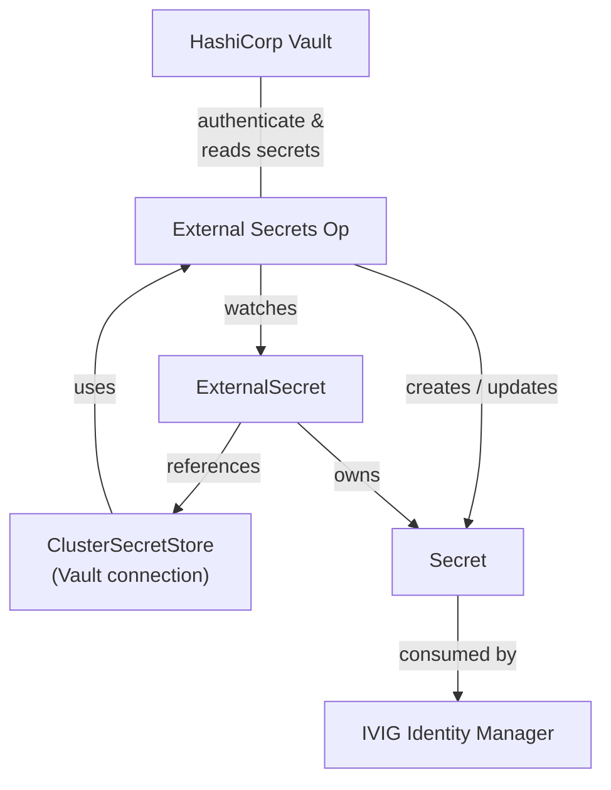

# Vault Integration

[HashiCorp Vault](https://developer.hashicorp.com/vault/docs) is a secure secrets management platform that centrally stores, controls access to, and protects sensitive data such as passwords, API keys, certificates, and encryption keys.

The [External Secrets Operator](https://external-secrets.io/) is a Kubernetes operator that synchronizes secrets from external secret management systems such as [Vault](https://developer.hashicorp.com/vault/docs) into Kubernetes Secret objects.

With Vault Integration enabled, you can securely store all or a subset of the [credentials from `secrets.yaml`](PURE-HELM.md#deploy) in Vault, which will be automatically propagated to the k8s cluster and exposed to the containers in a secure manner. Additionally, PKI related files, such as private keys and certificates can also be sourced from Vault and mounted to the containers in a similar way.

```
                              +---------------------+
                              |   HashiCorp Vault   |
                              +---------------------+
                                         ^
                                         | authenticates &
                                         | read secrets
                                         |
+--------------------+        +---------------------+
| ClusterSecretStore | -----> | External Secrets Op | -----------------+
| (Vault connection) |  uses  +---------------------+     creates /    |
+--------------------+                   |                updates      |
           ^                             | watches                     |
           |                             v                             v
           |                    +----------------+            +----------------+
           +------------------- | ExternalSecret | ---------> |     Secret     |
             references         +----------------+    owns    +----------------+
                                                                       |
                                                                       | consumed by
                                                                       v
                                                           +-----------------------+
                                                           | IVIG Identity Manager |
                                                           +-----------------------+
```



When using Vault in tandem with Argo CD, this recommended integration pattern even avoids exposing the sensitive data to Argo CD itself - it will merely reference, but never actually access or read the sensitive data. There is an alternative integration option using the Argo CD Vault Plugin which retrieves the secrets from within Argo CD, but thus is deemed less secure and obsolete.

## Prerequisites

The following components are assumed to be deployed and configured correctly for the target environment:
- [Vault](https://developer.hashicorp.com/vault/docs/get-vault#install-options) up and running (tested on Vault Enterprise 1.15.4)
- [External Secrets Operator](https://external-secrets.io/latest/introduction/getting-started/) running (0.16.2 or newer)

**Note:** In productive environments, the two components above are typically deployed and managed by a dedicated team, tweaked and hardened to match client-specific requirements. There is no intention to cover all deployment options and topologies. This document includes [step-by-step guidance](#developer-setup-from-scratch-and-early-debug) for users who will need to setup their own development environment from scratch but are unfamiliar with Vault or External Secrets. This guide includes extra debugging steps to facilitate early detection of configuration errors.

There are two optional user convenience scripts for importing from and exporting to Vault, which require the following dependencies in addition to what is already documented under [System Requirements](PURE-HELM.md#system-requirements):
- `vault-json-pack.sh`: bash 3.2, jq 1.5
- `vault-json-unpack.sh`: bash 3.2, jq 1.5

## Vault configuration

The steps in this guide have been tested on Vault Enterprise (the version listed above). Future versions might introduce changes to the web UI such as the labels and location of menu items and buttons, which could require some steps to be adjusted. Integration with Vault Community Edition (Open Source) requires slight adjustments as well, specifically, because it does not support Vault namespaces (the root namespace is used implicitly).

Vault namespaces provide isolated environments within a single Vault cluster. Each namespace can have its own:
- Secret engines
- Authentication methods
- Policies
- Identity entities/groups
- Tokens
- Audit devices (depending on configuration)

Vault configuration instructions, unless specifically noted otherwise, are carried out on Vault web UI, after successful login and making sure the desired Vault namespace is selected (bottom left) if your Vault uses multiple namespaces.

### Access Controls

On the Vault web UI, navigate via the main menu to **Policies / ACL Policies**. Create Policy "read-secrets" with the content below which will grant read access to sensitive data stored under `secrets` and `certs`.

```
# Read secret values
path "secrets/data/*" {
  capabilities = ["read"]
}
path "certs/data/*" {
  capabilities = ["read"]
}
```

### Kubernetes Authentication

The following steps document how to link the Kubernetes Cluster with Vault by registering and authorizing an already existing k8s service account, the example uses `idm-vault-viewer` in namespace `ivig-idm`. The steps are carried out on Vault web UI.

1. Using the main menu on the left, navigate to **Access** → **Authentication Methods**, select **Enable new method** and choose **Kubernetes**

2. Leave **Token type** set to **Default service**

3. Click **Enable Method**

4. Fill in the k8s API server endpoint in the **Kubernetes host** field

   **Note:** Ensure that Vault can reach the Kubernetes API server. In general, the k8s API server URL can be retrieved via `kubectl cluster-info`. If Vault is running in the same Kubernetes cluster, you should use the internal API endpoint instead: `https://kubernetes.default.svc`

5. Populate the **Kubernetes CA Certificate** field with the cluster CA certificate in PEM format
   ```bash
   kubectl get secret idm-vault-viewer-secret -n ivig-idm -o jsonpath='{.data.ca\.crt}' | base64 -d
   ```
   **Note:** Depending on your choice of deployment options, the service account may not exist yet at this point. Review the 3 options described below at the end of this section and chose your preferred option.

   **Note:** Depending on your Vault and Kubernetes configuration, you may leave this field empty if Vault is running in the same cluster. The Vault pod would see the same k8s CA in this case.
6. Populate the **Token Reviewer JWT** field (also called **Kubernetes API JWT** in certain version) with the service account token:
   ```bash
   kubectl get secret idm-vault-viewer-secret -n ivig-idm -o jsonpath='{.data.token}' | base64 -d
   ```
   **Note:** Depending on your Vault and Kubernetes configuration, you may leave this field empty if Vault is running in the same cluster. in this case, Vault's default service account's JWT will be used.
7. Click **Save**

8. Create a Kubernetes Authentication Role, Navigate to **Kubernetes** → **Roles**

9. Click **Create role**

10. Configure the role with the following values:

   | Field                                | Value                          |
   | ------------------------------------ | ------------------------------ |
   | **Name**                             | `idm-app-role`                 |
   | **Bound service account names**      | `idm-vault-viewer`             |
   | **Bound service account namespaces** | namespace you are deploying to |
   | **Generated Token's Policies**       | `read-secrets`                 |

11. Click **Save**

12. Return to the main navigation


**Note:** Depending on your choice of deployment options, the service account may not exist yet at this point. In this case, you will have to revisit steps 5 and 6 once the service account and its secret holding the JSON Web Token and CA certificate becomes available. A non-exhaustive list of options:
- **Option A:** Use the same namespace IVIG will be deployed to and automatically create the service account via the Helm chart (revisit steps 5 and 6 after first run of helm/Argo CD)
- **Option B:** Use the same namespace IVIG will be deployed to but create the minimally required k8s resources upfront, manually (no need to revisit steps later on)
- **Option C:** Create a service account in another namespace, e.g. 'external-secrets', manually - no overlap with the namespace IVIG will be deployed to, no need to revisit steps later, at the cost of scattering configuration across multiple namespaces which you may or may not prefer

For **Option B**, execute the following on your k8s cluster before executing the steps above. For **Option C** adjust namespace and service account and secret names according to your preference.

```sh
cat <<EOF | kubectl apply -f -
apiVersion: v1
kind: Namespace
metadata:
  name: ivig-idm
---
apiVersion: v1
kind: ServiceAccount
metadata:
  name: idm-vault-viewer
  namespace: ivig-idm
---
apiVersion: v1
kind: Secret
metadata:
  name: idm-vault-viewer-secret
  namespace: ivig-idm
  annotations:
    kubernetes.io/service-account.name: idm-vault-viewer
type: kubernetes.io/service-account-token
EOF
```

### Onboard Secrets

Create Secret Engine "secrets" (section "Generic", type KV which stands for key-value store) and populate it with secrets. Create one secret for each item you marked as externally managed by setting `general.install.externalSecret.*{cred,creds}` to `true` in `values-config.yaml`, with exactly matching names and the structure shown below.

Vault web UI allows you to specify keys and values one-by-one when creating secrets, but it is recommended to toggle the **JSON** switch on the top of the screen which allows you to paste all key-value pairs at once, increasing efficiency and decreasing the chance of human errors. Use one of the options below to create the secrets required.

#### Option A: Move exiting k8s secrets to Vault

If the secrets have already been deployed to k8s without Vault integration enabled, there is a convenient way to move these secrets to Vault. The following command demonstrates how the content of `pgcreds` can be retrieved from via `kubectl` in a JSON format suitable for Vault import.

```
kubectl get secret pgcreds --namespace ivig-idm -o json | jq '.data|map_values(@base64d)'
{
  "admpass": "********",
  "admuser": "postgres",
  "pgpass": "********",
  "pguser": "postgres"
}
```

Under Secret Engine "secrets", a secret with the name "pgcreds" needs to be created and filled with the JSON content resulting from the command above. The same process can be followed one-by-one for any other secret marked as externally managed, e.g. "extcreds", "isvdcred", "metricscreds", "mqcreds", "oidccreds", "regcred" set to `true` under `general.install.externalSecret`.

#### Option B: Create secrets in Vault right away

If one has not already deployed the secrets to the k8s cluster and would like to enter these in Vault right away, the following listing should serve as a reference. Secrets should be created just like described in the previous option, but the JSON content needs to be defined by the user.

Assuming all sensitive data is already captured in `secrets.yaml`, just copy over individual values under the appropriate keys within the Vault secrets. The listing below provides guidance on how the names in `secrets.yaml` should be mapped to keys within Vault secrets, and in specific cases, which `values-config.yaml` keys should be looked up for less sensitive data such as usernames (these are the ones with all-lowercase letters).

```
secrets/extcreds:
{
  "EXT_APPSERVER_PASSWORD": "********  APPSERVER_PASSWORD",
  "EXT_DBADMIN_PASSWORD": "********    DBADMIN_PASSWORD",
  "EXT_DB_PASSWORD": "********         DB_PASSWORD",
  "EXT_ISIMSYSTEM_PASSWORD": "******** ISIMSYSTEM_PASSWORD",
  "EXT_ITIMCIPHER_KEY": "********      ITIMCIPHER_KEY",
  "EXT_LDAP_PASSWORD": "********       LDAP_PASSWORD",
  "EXT_MAIL_PASSWORD": "********       MAIL_PASSWORD"
}

secrets/metricscreds:
{
  "LIBERTYMETRICS_USERNAME": "******** server.options[?(@.name=='libertyMetrics')].data[?(@.name=='userName')].value",
  "LIBERTYMETRICS_PASSWORD": "******** LIBERTYMETRICS_PASSWORD"
}

secrets/mqcreds:
{
  "mqadmin": "******** MQADMIN_PASSWORD",
  "mqlocal": "******** MQLOCAL_PASSWORD",
  "mqshare": "******** MQSHARE_PASSWORD"
}

secrets/oidccreds:
{
  "adminConsoleuser": "********   OIDC_ADMINCONSOLE_CLIENTID",
  "adminConsolesecret": "******** OIDC_ADMINCONSOLE_SECRET",
  "iscuser": "********            OIDC_ISC_CLIENTID",
  "iscsecret": "********          OIDC_ISC_SECRET",
  "restuser": "********           OIDC_REST_CLIENTID",
  "restsecret": "********         OIDC_REST_SECRET"
}

secrets/regcred:
{
  ".dockerconfigjson": "{\"auths\":{\"xyz.artifacts.************ }"
}


secrets/isvdcred:
{
  "admindn": "********  ldap['security.principal']",
  "adminpwd": "******** LDAP_PASSWORD"
}

secrets/pgcreds:
{
  "admuser": "******** db.admin",
  "admpass": "******** DBADMIN_PASSWORD",
  "pguser": "********  db.user",
  "pgpass": "********  DB_PASSWORD"
}
```

**Note:** the value for regcred needs to be provided exactly in the format returned by `kubectl get secret regcred  -o json | jq '.data | map_values(@base64d)'`. Providing connection details for multiple repositories within the same secret is required for many hardened real-life projects, this is the reason the full JSON structure is expected.

### PKI/x509 certificate management

The original starterkit performs certificate management within the container, therefore all PKI related files are exposed to both `isvgim` and`isvgimconfig` containers. This includes the private keys of all components and even the certificate authority private key. Additionally, containers such as ISVDI have access to much more than necessary PKI related files including private keys of other components.

This project enforces a stricter approach to exposing sensitive data where each container has access to certificates and more importantly private keys on a need-to-know basis. The CA private key is not exposed to any of the containers as certificate management is expected to happen in the admin domain (which can be isolated, offline or airgapped), and not within the application/runtime domain.

Specific subsets of the PKI related files are defined for each purpose, on a need-to-know-basis for ISVDI, ISVGIM and MQ. These subsets are exposed to the respective containers via k8s Secrets. Even without Vault integration this already increases the level of security. As an additional security measure, these subsets can be stored in Vault, in which case these will be exposed as external secrets to the respective containers, mounted in a similar manner to configmaps, but providing a significantly higher level of security.

The following subsets are defined:
- **isvdicerts** includes certificates of the components Directory Integrator needs to communicate with, or the signers of these certificates, plus the PEM file holding Directory Integrator's private key and certificate
- **isvgimcerts** includes the private key and certificate used by the IVIG application, the certificate of the local CA plus the CA bundle/truststore used to verify connections external components (i.e. when using an external data tier or SMTP server)
- **mqcerts** includes the private key and certificate for MQ along with the certificate of the local CA
- **isvdcerts** applies when internal LDAP is used, it includes certificates of components communicating with LDAP or the signers of such certificates, plus the PEM file holding Directory Integrator's private key and certificate
- **pgcerts** is only relevant if the internal DB is used, it includes the private key and certificate used by the database
- **all** includes the full set of files including certificate signing requests and the CA serial file for certificate management purposes only, it is not exposed to any container

#### Onboard PKI/x509 related data in Vault

Make sure the certificate directory for your target environment has already been populated via `cert-setup.sh`, `cert-util.sh` or a comparable alternative method with either locally or externally created certificates. This section assumes certificates for your User Acceptance Testing (UAT) environment are already available on an isolated admin server (ADM) under `smarterkit/config/certs/UAT` and demonstrates how you can import the above mentioned subsets of files into Vault.

Vault provides a REST API and CLI tool which could automate the import, however, that requires direct network access from the ADM server to Vault, which may not be available in the case of a hardened, airgapped target environment. The JSON file based manual transport and import is described first, followed by the direct import process.

##### JSON file based manual import (no direct access to vault is assumed)

The code listing below shows how to create and onboard each of the above sets in Vault. The example serves as a reasonable baseline, but of course one can expand or narrow down the set of files included in the subsets to meet project specific requirements.
```sh
# create Secret Engine "certs" (type KV) in Vault (see above)

# on your ADM server (isolated admin server)
cd smarterkit/config/certs/UAT


# The certificates and related files created earlier in this section will be imported under "certs" in the following secrets.

# certs/all: import JSON created with the following command on ADM:
../../../vault-json-pack.sh *

# certs/isvdicerts: import JSON created with the following command on ADM:
../../../vault-json-pack.sh *.crt isvdi.pem

# certs/isvgimcerts: import JSON created with the following command on ADM:
../../../vault-json-pack.sh isvgim.crt isvgim.key isvgimRootCA.crt xyz-ca-certs.crt

# certs/mqcerts: import JSON created with the following command on ADM:
../../../vault-json-pack.sh mq.{key,crt} isvgimRootCA.crt

# certs/isvdcerts: [optional] import JSON created with the following command on ADM:
../../../vault-json-pack.sh isvd.pem *.crt

# certs/pgcerts: [optional] import JSON created with the following command on ADM:
../../../vault-json-pack.sh pgsql.{key,crt}
```

##### Direct import via Vault CLI

If the ADM server has direct network access to Vault REST API, and the Vault command line tool is installed, the code listing above can be adjusted to directly import the JSON payload into Vault. The code listing below assumes the certificates and related files have already been prepared and available in the directory `smarterkit/config/certs/UAT`.

```sh
# create Secret Engine "certs" (type KV) in Vault (see above)

# on your ADM server (isolated admin server)
cd smarterkit/config/certs/UAT

# login to Vault via CLI
export VAULT_ADDR=https://vault.full-qualified-hostname.example.com/ # defaults to http://127.0.0.1:8200
export VAULT_NAMESPACE=example.com/vault-enterprise-namespace        # only for Vault Enterprise
# if Vault is running in developer mode, login via root token
vault login root
# for a production grade Vault config, one would typically use LDAP authentication (requires setup)
vault login -method=ldap -username=xyz

# JSON payload created in the same way as during manual import, but output is piped directly to 'vault' command
# The dash ('-') tells vault to read data from STDIN.
../../../vault-json-pack.sh * | vault kv put certs/all -
../../../vault-json-pack.sh *.crt isvdi.pem | vault kv put certs/isvdicerts -
../../../vault-json-pack.sh isvgim.crt isvgim.key isvgimRootCA.crt xyz-ca-certs.crt | vault kv put certs/isvgimcerts -
../../../vault-json-pack.sh mq.{key,crt} isvgimRootCA.crt | vault kv put certs/mqcerts -
# optionally, for internal data tier
../../../vault-json-pack.sh isvd.pem *.crt | vault kv put certs/isvdcerts -
../../../vault-json-pack.sh pgsql.{key,crt} | vault kv put certs/pgcerts -
```
**Note:** If unsure, it is recommended to inspect the output of the specific `vault-json-pack.sh` invocations (not piping to `vault` directly) as a first step, in the same way covered in the section above.

#### Example on how to renew certificates which are stored in Vault

The example below assumes external data tier and no direct access from the admin server to the target environment UAT (which represents a fictive User Acceptance Testing environment already referred to in the section above). The isolated admin server will be used to renew certificates, but data will only be stored there until the end of the renewal process, and deleted afterwards.

1. Export `certs/all` to JSON from Vault (i.e. via UI, visit the secret, toggle both JSON and 'review values', then copy the text) and transfer to admin server `/tmp/vault.json`
2. On an isolated admin server with the repo checked out, create a certs directory for the target environment
```
cd smarterkit/config
mkdir -p certs/UAT && cd certs/UAT
```
3. Split Vault export into files to populate the certs directory
```
cat /tmp/vault.json | ../../../vault-json-unpack.sh
```
4. Use `cert-util.sh` to list expiration dates
```
../../../cert-util.sh --list --directory $(pwd)
```
5. Renew certificates as required (example)
```
../../../cert-util.sh --renew --directory $(pwd)
```
6. Review and confirm
7. Transform and upload changes to Vault
```
# dump the appropriate subsets of files to JSON, then manually copy & paste JSON text into Vault
# we may be working in an airgapped environment and do not assume Vault API access.
../../../vault-json-pack.sh * # import JSON to certs/all in Vault
../../../vault-json-pack.sh *.crt isvdi.pem # import JSON to certs/isvdicerts in Vault
../../../vault-json-pack.sh isvgim.crt isvgim.key isvgimRootCA.crt xyz-ca-certs.crt # import JSON to certs/isvgimcerts in Vault
../../../vault-json-pack.sh mq.crt mq.key isvgimRootCA.crt # import JSON to certs/mqcerts in Vault
```
8. Confirm Vault update, then delete certs directory and with that, any sensitive data
```
rm -r ../../certs/UAT
```

## External Secrets

External Secrets provide a vendor agnostic uniform interface to expose secrets to k8s from a variety of secret management platforms. The External Secrets Operator communicates with the secret management provider (e.g. [HashiCorp Vault](https://www.vaultproject.io/), [IBM Cloud Secrets Manager](https://www.ibm.com/cloud/secrets-manager) or external secret management systems like [AWS Secrets Manager](https://aws.amazon.com/secrets-manager/), [Google Secrets Manager](https://cloud.google.com/secret-manager), [Azure Key Vault](https://azure.microsoft.com/en-us/services/key-vault/), [CyberArk Conjur](https://www.conjur.org/)) via product specific APIs and exposes the secrets in a uniform way. Provider-specific details such as connection parameters and configuration properties are encapsulated in **ClusterSecretStore** (or SecretStore) resources, used by the Operator to establish communication with the provider (see the diagram above in the introduction).

External Secrets can be configured for this project in two variants:
- Vendor agnostic way, where the **ClusterSecretStore** is expected to already exist and be configured against your choice of secret management platform
- Vault-based where the ClusterSecretStore and service account is automatically created based on additional configuration provided by you

### Adjusting the Helm chart configuration (vendor agnostic)

Make sure you already marked some of your secrets as externally managed by setting `general.install.externalSecret.*` to `true` in `values-config.yaml` (or an alternative values file specified for your deployment). Vault integration logic will read the same settings and only process the enabled items.

Next, enable Vault integration in your `values-config.yaml` (or an alternative values file e.g. an environment specific variant as you prefer) by appending the following YAML fragment (practically to the end of the file):

```yaml
vault:
  secretStore: idm-vault-secret-store
  refreshInterval: "0"
```
There is an even shorter form, where the same default secret store name is used (which has to already exist) and a default of "1h" (one hour) refreshInterval is configured:
```yaml
vault: true
```

With this change, configuration is complete. Just run `helm` or commit your changes to Git and sync via Argo CD to deploy. Also see **Tips and Tricks** section below for details.

#### Under the hood

Once Vault integration is enabled and a secretStore name is specified (or inferred), the Helm chart will automatically create an ExternalSecret for all secrets you marked as externally managed by setting `general.install.externalSecret.*` to `true` in `values-config.yaml` (or an alternative values file specified for your deployment). The ExternalSecrets will reference the ClusterSecretStore with the configured name, which will trigger the External Secrets Operator to fetch sensitive date from Vault, using connection parameters as provided in the ClusterSecretStore, and then create (or update) a k8s Secret for each ExternalSecret resource.

This heavy-lifting is achieved by a single Helm template under `templates/vault/008-externalsecret-loop.yaml`, which is provider-agnostic as opposed to being specific to Vault.

### Adjusting the Helm chart configuration (Vault-based)

This variant extends the above by automatically deploying the CusterSecretStore and the required service account. For this, the vault server and namespace have to be configured via `values-config.yaml` (or an alternative values file specified for your deployment). Therefore, the shorthand configuration via `vault: true` described above will not work in this case.

```yaml
vault:
  secretStore: idm-vault-secret-store
  refreshInterval: "0"
  server: https://vault.full-qualified-hostname.example.com/
  namespace: example.com/vault-enterprise-namespace
  caProvider:
    key: root-certs.crt
    name: local-ca-certs
    namespace: system
    type: Secret
```

**Note:** Vault server URL to be used may vary depending on deployment options and topology. If Vault is deployed into the same cluster, one could run `kubectl get svc -A | grep vault` to confirm the service and namespace to be used in a cluster-local URL `http://<SERVICE>.<NAMESPACE>.svc.cluster.local:8200` when running Vault in developer mode. In a more production-ready setup, HTTPS would be enabled, Vault might run in a different cluster, potentially only accessible via an Ingress on an different port such as 443. In any case, the user should make sure that the External System Operator can resolve and connect to the configured Vault server URL.

**Note:** The `namespace` is mandatory when dealing with Vault Enterprise but must be omitted or left empty (null or empty string) when using Vault Community Edition. Both `secretStore` and `refreshInterval` can be omitted, but it is mandatory to specify `server`, otherwise this part of the integration will not be activated, and no ClusterSecretStore will be created. The bottom line is that the presence of `server` will activate this part of the integration.

**Note:** The `caProvider` field in ClusterSecretStore is optional. If you don't specify it, the External Secrets Operator uses the system trust store (the CA certificates available in the operator's container). You will need to configure `caProvider` when Vault uses a certificate signed by an internal CA. Via `caProvider` you can reference a ConfigMap or Secret in a specific namespace, and a key within that Resource the operator should read the CA certificates from.

### Tips and Tricks

The k8s Secrets are automatically refreshed by the operator if the owning ExternalSecrets (k8s resource) is updated. In addition, Secrets are periodically refreshed by the operator as specified via `refreshInterval` where the value `"0"` disables periodic refresh. More precisely, the operator will:

- Create the Secret if it doesn't exist
- Update the Secret when the ExternalSecret specification changes
- Update the Secret regularly based on the `spec.refreshInterval` duration
  - When `spec.refreshInterval` is set to zero (the string `"0"`), periodic update does not occur
  - When `spec.refreshInterval` is set to another value, it **MUST** be a valid string representation of a duration e.g. "15m" or "1h30m30s" (see [ParseDuration](https://pkg.go.dev/time#ParseDuration) for details)
  - When `spec.refreshInterval` is absent or set to null, a default of "1h" is used
  - **Note:** setting `spec.refreshInterval` to an invalid value will cause an error

One can explicitly refresh the secret or query the timestamp of the last refresh as shown below. For a forced refresh, a dummy annotation with the current timestamp is added, which implies a refresh as the ExternalSecret is updated, and at the same time allows tracking when the last forced/manual refresh was triggered.
```sh
# explicit secret refresh
kubectl annotate es oidccreds force-sync=$(date +%s) --overwrite

# query last refresh time
kubectl get es oidccreds -o yaml | grep refreshTime
  refreshTime: "2026-07-02T13:37:00Z"

# should the refresh not happen, perform a hard reset by deleting the secret
# it should be automatically recreated with the most recent data from provider
kubectl get secret oidccreds -o yaml > oidccreds-backup.yaml
kubectl delete secret oidccreds
```

## Troubleshooting

**Note:** There is a multitude of possible deployment options and topologies each of which might require minor adjustments of configuration. There is no intention to provide a detailed Vault setup or integration guide for all possible scenarios. Users are welcome to customize and tailor these steps to their particular environments and recommended to consult [Vault documentation](https://developer.hashicorp.com/vault/docs).

### Developer setup from scratch and early debug

This section will assist users less familiar with Vault, External Secrets and Kubernetes to set up a quick development environment and include additional steps to diagnose configuration errors at an early stage.

#### Setting up prerequisites

The code listing below will deploy the latest version of Vault Community Edition in developer mode (no TLS, in-memory storage, unsealed), External Secrets Operator into their own namespaces and exposes Vault web UI so you can conveniently assess it with your web browser without having to setup a NodePort or Ingress. This port-forward only exists for the lifespan of your ssh session.

**Warning:** As noted above, Vault in developer mode uses in-memory storage. **All configuration data and secrets are lost once the Vault is stopped (or restarted).** One might prefer to deploy Vault in standalone mode rather than developer mode; it requires additional setup which is outside of the scope of this document.

```
helm repo add hashicorp https://helm.releases.hashicorp.com
helm repo add external-secrets https://charts.external-secrets.io
helm repo update

helm install vault hashicorp/vault --set "server.dev.enabled=true" --namespace vault --create-namespace
helm install external-secrets external-secrets/external-secrets -n external-secrets --create-namespace --set installCRDs=true

kubectl port-forward -n vault service/vault 8200:8200 --address 0.0.0.0 &
```

In this scenario, Vault is running in a namespace 'vault' within the same cluster we are deploying IVIG to, in developer mode. Therefore, the cluster-internal Vault server URL is `http://vault.vault.svc.cluster.local:8200`.

#### Configuration process with early verification steps

One should follow the documented process for [Vault configuration above](#vault-configuration). This guide will follow **Option B** documented at the bottom of section [Kubernetes Authentication](#kubernetes-authentication), with some extra steps. These extra steps, prefixed with "**DEBUG:**" below, will manually create some k8s resources which would be automatically deployed later, the goal is to facilitate the early detection of configuration issues, even before the Helm chart would deploy IVIG.

**Note:** While the Helm templates would fill in the namespace dynamically based on configuration in `values.yaml`, the example code listings assume that the target namespace is `ivig-idm`, therefore, any manual step will have to be carefully and consistently adjusted if another namespace is used.

As we are choosing **Option B**, we create the service account, token and role binding upfront. Run the command from **Option B** to create the namespace, service account and token first.

**DEBUG:** We create ClusterRoleBinding now for early debugging (would be created by the Helm chart)
```yaml
apiVersion: rbac.authorization.k8s.io/v1
kind: ClusterRoleBinding
metadata:
  name: idm-vault-viewer
roleRef:
  apiGroup: rbac.authorization.k8s.io
  kind: ClusterRole
  name: system:auth-delegator
subjects:
  - kind: ServiceAccount
    name: idm-vault-viewer
    namespace: ivig-idm
```

Execute all steps of [Vault configuration](#vault-configuration) up to **Step 4** of [Kubernetes Authentication](#kubernetes-authentication). As we are setting up cluster-internal connection to Vault, some additional explanation is provided on the steps 4 to 6.
- Step 4: use the cluster-internal server API endpoint https://kubernetes.default.svc (we are running within the same cluster)
- Step 5: for this particular setup, you can skip filling this field (the vault pod will default to the same CA because we are running in the same cluster) or just follow the step, both should work
- Step 6: in this case, we could either skip proving a JWT (to use the default vault service account JWT, as we are running within the same cluster) or just follow the step and provide the JWT of our dedicated service account

Next, start with [onboarding secrets](#onboard-secrets), but stop after creating the secret engine.

**DEBUG:** After creating the secret engine, we create a single secret `metricscred` just for early debugging purposes (would be created by the Helm chart at a later point automatically)

**DEBUG:** In another terminal, we enable Vault audit logs and watch kubernetes authentication related entries:
```
kubectl exec -it vault-0 -n vault -- vault audit enable file file_path=stdout
kubectl logs -f vault-0 -n vault | grep "auth/kubernetes/login"
```

**DEBUG:** We create ClusterSecretStore now, manually (would be created by the Helm chart later on)
- no namespace as we are using Vault Community Edition
- no caProvider section as TLS is disabled in Vault developer mode
```
apiVersion: external-secrets.io/v1
kind: ClusterSecretStore
metadata:
  name: "idm-vault-secret-store"
spec:
  provider:
    vault:
      auth:
        kubernetes:
          mountPath: kubernetes
          role: idm-app-role
          serviceAccountRef:
            name: idm-vault-viewer
            namespace: ivig-idm
      server: http://vault.vault.svc.cluster.local:8200
      version: v2
```

Confirm the ClusterSecretStore was created successfully, is valid and ready.
```
kubectl get css
NAME                     AGE   STATUS   CAPABILITIES   READY
idm-vault-secret-store   15s   Valid    ReadWrite      True
```
If not, run `kubectl describe css idm-vault-secret-store`, inspect the output and check Vault logs in the other terminal.


**DEBUG:** We create a single external secret for metricscreds now, manually (would be created by the Helm chart)
```
apiVersion: external-secrets.io/v1
kind: ExternalSecret
metadata:
  name: metricscreds
  namespace: ivig-idm
spec:
  refreshInterval: "0"
  secretStoreRef:
    kind: ClusterSecretStore
    name: "idm-vault-secret-store"
  target:
    name: metricscreds
  dataFrom:
    - extract:
       key: secrets/metricscreds
```
Confirm the secret was successfully propagated from Vault to a k8s Secret witin the `ivig-idm` namespace.
```
kubectl get secret metricscreds -n ivig-idm
NAME           TYPE     DATA   AGE
metricscreds   Opaque   2      26s
```

At this point, we have confirmed the following:
- Vault: configuration of Kubernetes authentication method is ok
- Service account, token and authorization are configured properly
- ClusterSecretStore is configured properly
- ExternalSecret metricscred works, it correctly propagates a secret from Vault to a k8s secret within namespace ivig-idm

We can proceed where we left off - continue following the steps for [onboarding secrets](#onboard-secrets).

### Further Diagnostics

This section captures a non-exhaustive list of helpful commands to diagnose Vault-Kubernetes communication issues.

#### Enable Vault Audit and filter logs

To enable Vault audit logs and watch kubernetes authentication related entries:

```
kubectl exec -it vault-0 -n vault -- vault audit enable file file_path=stdout
kubectl logs -f vault-0 -n vault | grep "auth/kubernetes/login"
```

#### Restarting the External Secrets Operator

In order for ClusterSecretStore changes to take effect immediately, one should restart the operator with the following command:

```
kubectl rollout restart deployment external-secrets -n external-secrets
```

Right after this command, all connections to Vault will be re-established which provides a good opportunity further analyse Vault logs and diagnose configuration errors.

#### Reset kubernetes authentication method in Vault

The following example demonstrates how one can re-initialize the authentication method without the Vault Web UI using mostly defaults and a wildcard setting for the bound service account and its namespace. The current configuration will be wiped and recreated based on the following:

- The cluster-internal k8s server API endpoint is configured
- The defaults are used, including vault service account JWT and k8s CA
- A role is created granting read permissions to any service account in any namespace

```
kubectl exec -it vault-0 -n vault -- sh
/ $ vault auth disable kubernetes
Success! Disabled the auth method (if it existed) at: kubernetes/
/ $ vault auth enable kubernetes
Success! Enabled kubernetes auth method at: kubernetes/
/ $ vault write auth/kubernetes/config kubernetes_host=https://kubernetes.default.svc.cluster.local
Success! Data written to: auth/kubernetes/config
/ $ vault read auth/kubernetes/config
Key                                  Value
---                                  -----
disable_iss_validation               true
disable_local_ca_jwt                 false
issuer                               n/a
kubernetes_ca_cert                   n/a
kubernetes_host                      https://kubernetes.default.svc.cluster.local
pem_keys                             []
token_reviewer_jwt_set               false
use_annotations_as_alias_metadata    false

vault write auth/kubernetes/role/idm-app-role \
    bound_service_account_names="*" \
    bound_service_account_namespaces="*" \
    policies="read-secrets" \
    ttl="1h"
```

This configuration will bypass any subtle spelling or metadata mismatches between what service account the External Secrets operator uses and for Vault request and what Vault expects and allows. It is intended for debug purposes only.

#### View raw token claims

To debug "permission denied" errors, we can capture a token of the service account and decode it: `kubectl create token idm-vault-viewer -n ivig-idm --duration=10m`

Copy that long token string, and paste it into the Encoded box [here](jwt.io). Look at the payload section on the right.

You need to check two specific fields:
- iss (Issuer): For example https://kubernetes.default.svc.cluster.local
- kubernetes.io block: Verify the exact `serviceaccount.name` and `namespace` strings.

